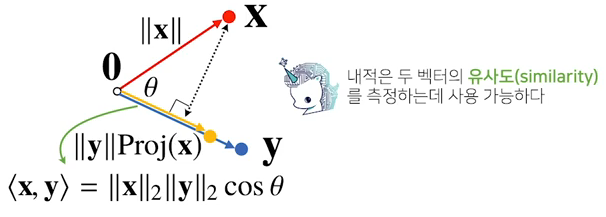

### Vector 벡터
- CS
    - 숫자를 원소로 가지는 리스트나 배열
    - 행벡터와 열벡터가 있다.
- Math
    - 방향과 크기를 가진 양. 원점으로부터 상대적 위치를 표현함.
    - 벡터에 숫자를 곱하면 길이만 변환. = 스칼라곱. 단, 스칼라가 0보다 작으면 반대방향이 됨.

#### 벡터의 덧셈과 뺄셈, 성분곱(Hadamard product)  
>두 벡터가 같은 모양(같은 크기)를 갖고 있다면,  
같은 위치의 원소끼리 연산 가능하다.


### Vector Norm 벡터 노름
https://mathworld.wolfram.com/VectorNorm.html  
노름은 원점으로부터의 거리.  
- L1-norm
    - 각 성분의 절대값을 승수(power) 없이 걍 더한 거
- L2-norm
    - 우리가 아는 유클리드 거리. 각 성분의 제곱합을 제곱근한 거  
&nbsp;

노름의 종류에 따라 **기하학적 성질**이 달라진다.
- 원이란, 원점으로부터 거리가 같은 곳임. L1-norm의 원은 마름모꼴이 됨.
- 머신러닝에서 각 성질이 필요할 때가 있으니 둘 다 중요

&nbsp;

 ### 벡터간의 거리와 각도
- 벡터간의 거리는 벡터의 뺄셈으로 구한다.
    - ||y-x|| = ||x-y||
- 벡터간의 각도는 L2-norm만 계산할 수 있다.
    - 제 2 코사인 법칙으로 계산할 수 있다. 그리고 내적을 이용하면 더 간단해진다.
    - $cos\theta = \displaystyle\frac{<x,y>}{||x||\cdot||y||}$
    - 내적을 각 벡터의 거리곱으로 나눈다.
```python
def angle(x, y):
    v = np.inner(x,y) / (l2_norm(x) * l2_norm(y))
    theta = np.arccos(v)
    return theta
```

### 내적의 해석
https://wikidocs.net/22384  
내적은 두 벡터의 유사도를 측정하는데 사용한다.  
$\vec{x}\cdot\vec{y} = |\vec{x}||\vec{y}|cos\theta$  



&nbsp;  
&nbsp;

### 행렬 Matrix
행벡터를 원소로 가지는 2차원 배열이 기본. (행벡터들의 모임)  
n x m 행렬은 n개의 row와 m개의 column을 가짐.  
벡터가 공간상에서 한 점을 의미한다면, 행렬은 여러 점들을 의미함.

#### 행렬의 덧셈, 뺄셈, 성분곱, 스칼라곱
> 느낌 아니까

### 행렬곱 Matrix multiplication
A $_{nm}$ $\cdot$ B $_{ml}$  
- 앞의 열과 뒤의 행 개수가 같아야 함.
- 앞의 행벡터와 뒤의 열벡터의 내적이 원소가 됨. ㅡ ㅣ
```python
A @ B           # numpy는 @로 연산 가능
```

### 행렬의 내적
수학에서의 행렬 내적과 numpy의 행렬 내적이 다르다.
- numpy의 행렬 내적
    - np.inner 를 사용함
    - A $_{nm}$ , B $_{lm}$ 일 떄, A $\cdot$ B $^T$ 이다.
- 수학의 행렬 내적
    -  A $_{nm}$ , B $_{lm}$ 일 떄, tr( A $\cdot$ B $^T$ ) 이다.
    - tr은 trace 트레이스로, 주대각의 합이다.

#### Transpose matrix 전치행렬　$X^T$


## 행렬의 또 다른 이해
행렬은 벡터공간에서 사용되는 연산자(operator)로 볼 수 있다.  
즉, 다른 두 데이터를 연결하는 연산자인 셈이다.  
이를 통해 주어진 데이터에서 **패턴을 추출**하거나 **압축**을 할 수 있다.  
아래의 예시는 m차원 공간에 있는 벡터를 n차원 공간의 벡터로 정사영 시키는 개념이다. #TODO


### 역행렬  #TODO
위의 방법을 거꾸로 진행하는게 역행렬이다.  
단, 행과 열이 같아야 역행렬을 구할 수 있다.

```python
X = np.array([[1, -2, 3], [7, 5, 0], [-2, -1, -2]])
np.linalg.inv(X)
```

### 유사역행렬 Pseudo-Inverse　무어-펜로즈 Moore-Penrose 역행렬 #TODO
A $^+$ 로 표기

```python
```
