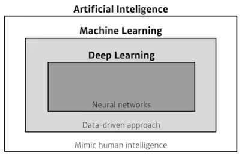
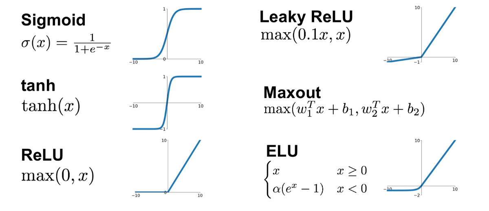
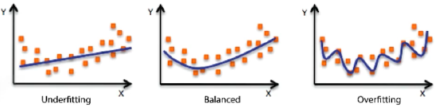
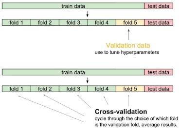

## Deep Learning 딥러닝
#### 딥러닝의 범주와 구분  


#### 좋은 딥러닝의 3가지 요소
1. 구현 실력 Implementation Skills: tensorflow, pytorch...
2. 수학 실력 Math Skills: Linear Algebra, Probability
3. 최신 트랜드 Knowing a lot of recent Papers  
&nbsp;

### 딥러닝의 주요 요소
- Data
    - 데이터는 해결하고자 하는 문제 유형에 따라 달라진다.  
      Data depend on the type of the problem to solve.
- Model : 데이터를 학습할 모델, 데이터를 내가 알고 싶어하는 클래스 레이블로 바꾸는 것.
    - 모델의 성질에 따라 결과가 바뀔 수 있기 때문에 태크닉들이 필요.
    - 모델은 여러 layer로 구성됨.
- Loss function : 학습 시 사용할 피드백을 정의함.
    - layer마다 들어있는 weight의 parameter를 어떻게 업데이트할지에 대한 기준.
    - 단순히 loss가 줄어든다고 우리가 원하는 목표를 이룬다는 보장은 없음. 
    - Regression Task: 주로, MSE
    - Classification Task: 주로, CE (Cross Entrophy)
    - Probabilistic Task: 주로, MLE
- Algorithm : optimization algorithm
    - Optimizer는 학습 진행 방식을 결정한다.
    - 학습한 데이터만이 아니라 새로운 데이터에도 잘 작동하는지에 대한 알고리즘이 필요.  
&nbsp;

## Neural Networks
Neural networks are computing systems vaguely inspired by the biological neural networks that constitute animal brains.  
신경망이 뉴런을 모방했다곤 보기 힘들다.(역전파 등을 고려하면) 때문에 뉴런에서 영감을 받았다 정도가 적당하다고.

하늘을 날고 싶다고 새를 모방한게 아닌 새에서 영감을 받아 비행기를 만든것과 비슷한 이치다.

In other words, Neural networks are function approximators that stack affine transformations followed by nonlinear transformations.

### 인공 뉴런 Aritificial Neuron
- 노드와 엣지로 구성
- 하나의 노드안에서 입력과 가중치를 곱하고 더하는 선형구조.
- Activation function(활성 함수)을 통해 비선형 구조(non-linear)를 표현 가능.

### 인공 신경망 Artificial Neural Network
- 여러 개의 인공뉴런들이 모여 연결된 형태
- 뉴런들이 모인 하나의 단위를 층(layer)라고 하며, 여러 층(multi layer)으로 쌓을 수 있음.
- Input layer, 1~n Hidden layer, Output layer

&nbsp;

# Basic
### Tensor 텐서

## Layer 레이어
- 텐서들을 입력받아 가중치를 적용한 후 결과 텐서들을 출력함.
- 물론, 상태가 없는 레이어도 있지만 대부분은 가중치라는 레이어 상태를 가짐.
- 가중치는 확률적 경사 하강법에 의해 학습되는 하나 이상의 텐서
- 주요 레이어
    - Dense, Activation, Flatten, Input ...

### Dense
- 완전 연결 레이어 (Fully-Connected Layer)
- 노드 수(유닛 수), 활성 함수(activation)등을 지정
- name을 통해 레이어간 구분 가능
- 가중치 초기화 kernel_initializer
    - 신경망 성능에 큰 영향을 주는 요소로, 가중치 초기값에 따라 학습된 신경망의 성능 차이가 날 수 있다.
    - 보통 가중치의 초기값으로 0에 가까운 무작위 값을 사용
    - 오차역전파 알고리즘은 기본적으로 경사하강법을 사용하기 때문에 최적해가 아닌 지역해에 빠질 가능성이 있다.
    - Keras에서는 기본적으로 Glorot uniform 가중치(Xavier 분포 초기화), zeros bias로 초기화
    - kernel_initializer 인자를 통해 다른 가중치 초기화로 변경 가능
    - https://keras.io/api/layers/initializers/  
```python
Dense(10, activation='softmax', kernel_initializer='he_normal', name='Dense Layer')
```

### Activation
https://keras.io/api/layers/activations/  


### Flatten
- 배치 크기를 제외하고 데이터를 1차원으로 쭉 펼치는 작업
- (128, 3, 2, 2)   ->  (128, 12)

### Input
- 모델에 입력되는 레이어로, shape, dtype을 포함하여 정의
- 하나의 모델은 여러 개의 입력을 가질 수도 있다.
- summary() 메소드로는 안 보임.
```python
Input(shape=(28,28), dtype=tf.float32)
```
&nbsp;

## Model 모델
레이어들로 구성된 비순환 유향 그래프 (Directed Acyclic Graph, DAG) 구조.

### 모델 구성
- Sequential()
- Subclassing 서브클래싱
- 함수형 API

### Sequential()
- 모델이 순차적인 구조로 진행될 때 사용하는 방법
- 다중 입력 및 다중 출력같은 복잡한 모델을 구성할 순 없음.
```python
from tensorflow.keras.layers import Dense, Input, Flatten
from tensorflow.keras.models import Sequential, Model
from tensorflow.keras.utils import plot_model

model = Sequential()
model.add(Input(shape=(28, 28)))
model.add(Dense(300, activation='relu'))
model.add(Dense(100, activation='relu'))
model.add(Dense(10, activation='softmax'))
model.summary()

model = Sequential([Input(shape=(28, 28), name='Input'),
                    Dense(300, activation='relu', name='Dense1'),
                    Dense(100, activation='relu', name='Dense2'),
                    Dense(10, activation='softmax', name='Dense3')])
                    
plot_model(model)

```

### 함수형 API
- 가장 권장되는 방법
- 모델을 복잡하고, 유연하게 구성 가능
- 다중 입출력을 다룰 수 있음

```python
inputs = Input(shape=(28, 28, 1))
x = Flatten(input_shape=(28, 28, 1))(inputs)
x = Dense(300, activation='relu')(x)
x = Dense(100, activation='relu')(x)
x = Dense(10, activation='softmax')(x)

model = Model(inputs=inputs, outputs=x)
model.summary()


# Concatenate를 쓰면 조금 더 복잡해진다.
from tensorflow.keras.layers import Concatenate

input_layer = Input(shape=(28, 28))
hidden1 = Dense(100, activation='relu')(input_layer)
hidden2 = Dense(30, activation='relu')(hidden1)
concat = Concatenate()([input_layer, hidden2])
output = Dense(1)(concat)

model = Model(inputs=[input_layer], outputs=[output])
model.summary()


# Input이 두 개인 경우
input_1 = Input(shape=(10, 10), name='Input_1')
input_2 = Input(shape=(10, 28), name='Input_2')

hidden1 = Dense(100, activation='relu')(input_2)
hidden2 = Dense(10, activation='relu')(hidden1)
concat = Concatenate()([input_1, hidden2])
output = Dense(1, activation='sigmoid', name='output')(concat)

model = Model(inputs=[input_1, input_2], outputs=[output])
model.summary()


# Output이 두 개인 경우
input_1 = Input(shape=(10, 10), name='Input_1')
hidden1 = Dense(100, activation='relu')(input_1)
hidden2 = Dense(10, activation='relu')(hidden1)
output = Dense(1, activation='sigmoid', name='main_output')(hidden2)
sub_output = Dense(1, name='sum_output')(hidden2)

model = Model(inputs=[input_1], outputs=[output, sub_output])
model.summary()

# 다중 입력, 다중 출력
input_1 = Input(shape=(10, 10), name='Input_1')
input_2 = Input(shape=(10, 28), name='Input_2')

hidden1 = Dense(100, activation='relu')(input_2)
hidden2 = Dense(10, activation='relu')(hidden1)
concat = Concatenate()([input_1, hidden2])

output = Dense(1, activation='sigmoid', name='main_output')(concat)
sub_output = Dense(1, name='sub_output')(hidden2)

model = Model(inputs=[input_1, input_2], outputs=[output, sub_output])
model.summary()

```

### 서브클래싱 Subclassing
- 커스터마이징에 최적화된 방법
- Model 클래스를 상속받아 Model이 포함하는 기능을 사용할 수 있음.
    - fit(), svaluate(), predict()
    - save(), load()
- 주로 call() 메소드안에서 원하는 계산 가능
    - for, if, 저수준 연산 등
- 권장되는 방법은 아니지만 어떤 모델의 구현 코드를 참고할 때, 해석할 수 있어야 함.

```python
class MyModel(Model):
    def __init__(self, units=30, activation='relu', **kwargs):
        super(MyModel, self).__init(**kwargs)
        self.dense_layer1
```


&nbsp;

## Optimization
Important Concepts in Optimization
- Generalization
- Under-fitting vs. Over-fitting
- Cross validation
- Bias and Variance Trade-off
- Bootstrapping
- Bagging and boosting  
&nbsp;

### Generalizaion  
How well the learned model will behave on unseeen data.  
일반화 성능이 오를 수록 좋을까?

### Under-fitting vs. Over-fitting


### Cross-validation  
Cross-validation is a model validation technique for assessing how the model will generalize to an independent (test) data set.  
train data를 k개로 나누고 k-1개로 학습 후 남은 하나로 validation을 진행하는 방법.  
이를 통해 validation data와 train data를 합칠 수 있기 때문에 train data가 늘어나는 효과를 볼 수 있다.


Bias and Variance Trade-off


Gradient Descent
- First-order iterative optimization algorithm for finding a local minimum of a differentiable function.