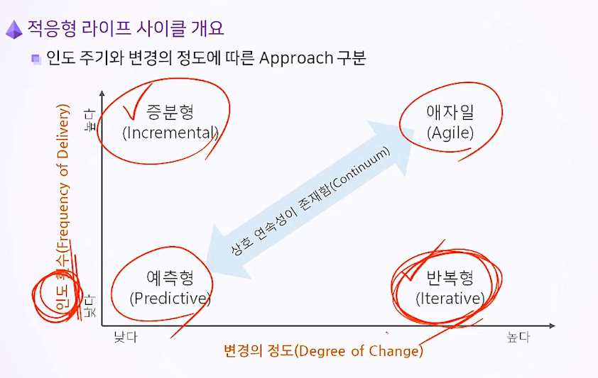
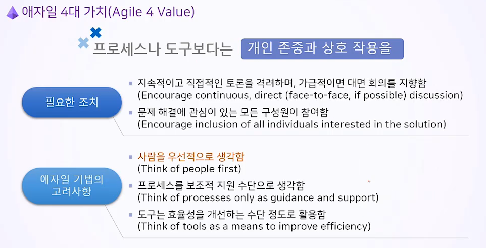
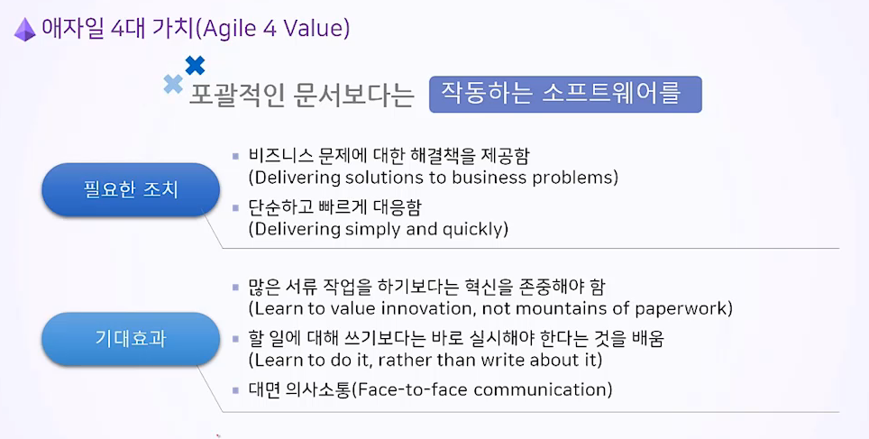
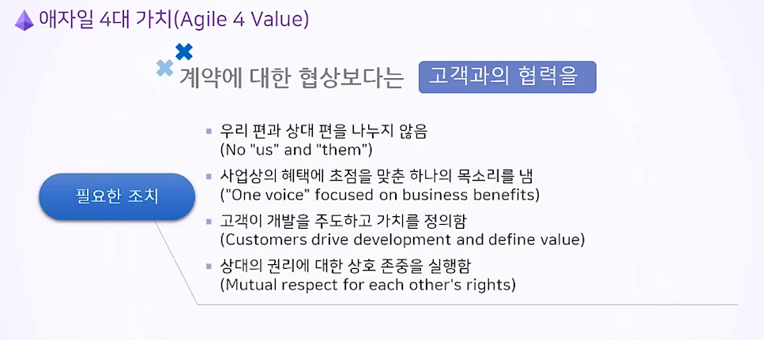
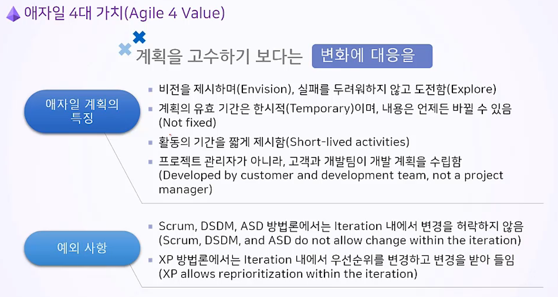

## Basic of Team Project
- 상호협력적이고 점진적으로. 혼자 고민하지 말고 팀원들의 도움을 받자.

- DEV Commandments, DEV Guidelines 를 작성할 것.

&nbsp;

## Predictive = 예측형 = Waterfall
- 분업화돼서 개개인의 역할이 한정적일 경우

&nbsp;

## Agile = 적응형  

- 불확실성이 높은 프로젝트이기 때문에, T 자형 인재(Cross Functional) 이 아니면 힘들다.  

- 변화에 끊임없이 적응해 가면서, **새로운 Use Case 혹은 제품 백로그를 관리해야 한다.**
> 제품 백로그 (Product Backlog) 구성 요소
>> 기능(Feature), 결함(Defect), 기술적 작업(Technical Work), 지식(Knowledge)

- 여러 **스프린트 Sprint(=증분 Increment)** 으로 개발한다.
    - 스프린트 Sprint : 계획 - 개발 - 배포
    - 증분과 스프린트는 엄밀하게는 다르지만, 대게 같은 볼륨으로 설정하기 때문에 걍 비슷한 걸 의미한다고 알면됨.

- 우선 순위가 높은 기능을 먼저 개발해고 배포해야 한다.

- Sprint를 더 잘게 나눈 것은 To-Do List로 본다.

- 계획된 기간이 끝나면 해당 스프린트를 완료했건 안했건 중단하고 다음 단계로 간다.?
- 애자일의 범위 분류: 테마(Theme) > 에픽(Epic) > 기능(Feature) > 유저 스토리(User Story)

### Agile Manifesto = Agile 4 Values
1. Individuals and interactions over processes and tools
    - 프로세스나 도구 보다는 개인 존중과 상호작용을  
2. Working software over comprehensive documentation
    - 포괄적인 문서보다는 작동하는 소프트웨어를  
3. Customer collaboration over contract negotiation
    - 계약에 대한 협상보다는 고객과의 협력을  
4. Responding to change over following a plan
    - 계획을 고수하기 보다는 변화에 대응을  

### Agile 12 Principles
1. 초기부터 지속적으로 배포함으로써 고객을 만족시키는 것이 최우선 가치다.
    - 초기부터 개발물을 제공하는 것이 Risk도 감소하고 Value가 증가한다.
2. 변화하는 요구 사항의 수용을 환영한다.
3. 최대한 짧은 주기(2주~2달)로 배포한다.
4. 비즈니스 담당자와 개발자가 함께 일하기.
5. 동기부여된 팀원들로 프로젝트팀 만들기.
6. 얼굴보고 대화하기.
7. 작동하는 소프트웨어로 진척을 판단.
8. 지속 가능한 개발 속도 유지.
9. 좋은 기술, 설계에 관심
    - 우수한 기술과 우수한 디자인에 대한 지속적인 관심은 agility를 향상시킨다.
10. 단순성(수행되지 않은 작업량을 최대화하는 기술)이 필수
11. 최고의 아키텍처, 요구 사항 및 디자인은 자기 조직화 팀(Self-Organization Team)에서 나온다.
12. 정기적으로 보다 더 효과적인 방법을 적용해보고, 그에 따라 행동을 조율하고 조정한다.

### Agile 방법론이 적용된 모델들
    - 스크럼(Scrum)
        - 반복과 증분에 따라 개발 일정을 진행함
    - 칸반(Kanban)
        - 스프린트 내에서의 계획과진행상황을 시각화하고 종합적인 관점에서 프로젝트 현황을 분석함.
    - 익스트림 프로그래밍(eXtreame Programming)
        - 개발자 스스로가 주도하여 창의적으로 문제를 해결하며 개발하는 것.

&nbsp;

## Incremental = 증분형
- 스프린트 단위로 나뉜 기능들을 우선 순위에 따라 계속 추가해 나가기를 반복함.

- Agile과 비슷하나, **전체 계획(상위 수준의 계획)이 미리 정해져 있고**, 상세한 범위는 스프린트 단위로 나눠서 블럭 쌓듯이 하나하나 추가해 나가는게 다르다.

- 사실 Agile이랑 구분이 모호한 경우도 많은 듯.

&nbsp;

## Iterative = 반복형
- Agile이랑 같은데, 프로젝트 결과물을 **한 번에 배포**하는게 다름.

- 스토리보드 기법(Storyboarding)이 해당함.

&nbsp;

## Hybrid Life Cycle = Agile + Predictive
- Type 1 : 선 Agile 후 Predictive
    - 초반에 긴박감을 주고, raw한 결과물을 도출한 후, Predictive로 전환.
- Type 2 : Agile 과 Predictive를 동시 사용
    - 점진적으로 Agile로 전환해 나가는 방식. 매우 일반적인 시나리오.
- Type 3 : 전체는 Predictive 특수한 상황에만 Agile 도입
    - 예상하지 못한 긴급한 이슈만 Agile하게 함.
- Type 4 : 전체는 Agile 특수한 상황에만 Predictive 도입
    - Agile 사고로 창의적인 개발을 하되, 상세한 개발은 외주를 맡김.

## Scrum 스크럼
- 스크럼 마스터(Scrum master), 개발팀(Dev team), 제품 책임자(Product owner)로 구성

&nbsp;

## Details of Agile 4 Values 

