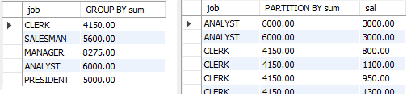

### EXPLAIN
EXPLAIN은 MySQL에서 사용되는 키워드로, SQL 쿼리의 실행 계획을 분석하여 쿼리의 성능을 평가하거나 최적화 하는데 도움을 주는 명령입니다. EXPLAIN을 사용하면 MySQL 쿼리 옵티마이저가 쿼리를 실행하기 위해 어떤 방식으로 데이터에 접근하고 어떤 인덱스를 사용하는지에 대한 정보를 제공합니다.  

EXPLAIN의 필드
1. id: EXPLAIN 결과에서 각 테이블 액세스 또는 서브쿼리에 대한 고유한 식별자입니다. 여러 테이블이나 서브쿼리가 있는 쿼리에서는 여러 개의 id가 나타날 수 있습니다.

2. select_type: 쿼리 내에서 어떤 종류의 SELECT 작업을 수행하는지를 나타냅니다.
    - SIMPLE: 단순한 SELECT 쿼리.
    - PRIMARY: 주 쿼리 또는 서브쿼리의 바깥 부분.
    - SUBQUERY: 서브쿼리.
    - DERIVED: FROM 절에서 파생된 테이블.
    - 등등...
3. table: 조회 중인 테이블의 이름입니다.

4. partitions: 테이블 파티션 정보입니다.

5. type: 테이블에서 레코드를 검색하는 방법을 나타냅니다. 다양한 값이 사용되며, 일반적인 값으로는 다음이 있습니다.
    - ALL: 테이블의 모든 레코드를 스캔.
    - index: 인덱스를 사용하여 레코드를 스캔.
    - range: 범위 스캔.
    - ref: 참조 스캔.
    - 등등...
6. possible_keys: 쿼리 옵티마이저에서 고려한 인덱스 목록입니다.

7. key: 실제로 사용된 인덱스입니다.

8. key_len: 사용된 인덱스의 길이입니다.

9. ref: 인덱스를 참조할 때 사용하는 값 또는 표현식입니다.

10. rows: 검색 조건에 의해 반환된 레코드 수입니다.

11. filtered: 행 필터링 비율을 나타냅니다.

12. Extra: 추가 정보입니다. 이 필드에는 쿼리 실행에 관련된 다양한 정보가 포함될 수 있습니다.  

EXPLAIN을 사용하여 쿼리 실행 계획을 분석하면 쿼리의 성능을 최적화하고 인덱스를 적절하게 활용하는 데 도움이 됩니다. 쿼리의 성능 문제를 식별하고 개선하기 위해 이 정보를 활용할 수 있습니다.

<br>
<br>
<br>

# 예제를 통한 실전 구문
my_emp
| empno | ename  | job       | mgr  | hiredate   | sal     | comm    | deptno |
|-------|--------|-----------|------|------------|---------|---------|--------|
| 7369  | SMITH  | CLERK     | 7902 | 1980-12-17 | 800.00  |         | 20     |
| 7499  | ALLEN  | SALESMAN  | 7698 | 1981-02-20 | 1600.00 | 300.00  | 30     |
| 7521  | WARD   | SALESMAN  | 7698 | 1981-02-22 | 1250.00 | 500.00  | 30     |
| 7566  | JONES  | MANAGER   | 7839 | 1981-04-02 | 2975.00 |         | 20     |
| 7654  | MARTIN | SALESMAN  | 7698 | 1981-09-28 | 1250.00 | 1400.00 | 30     |
| 7698  | BLAKE  | MANAGER   | 7839 | 1981-05-01 | 2850.00 |         | 30     |
| 7782  | CLARK  | MANAGER   | 7839 | 1981-06-09 | 2450.00 |         | 10     |
| 7788  | SCOTT  | ANALYST   | 7566 | 1987-04-19 | 3000.00 |         | 20     |
| 7839  | KING   | PRESIDENT |      | 1981-11-17 | 5000.00 |         | 10     |
| 7844  | TURNER | SALESMAN  | 7698 | 1981-09-08 | 1500.00 | 0.00    | 30     |
| 7876  | ADAMS  | CLERK     | 7788 | 1987-05-23 | 1100.00 |         | 20     |
| 7900  | JAMES  | CLERK     | 7698 | 1981-12-03 | 950.00  |         | 30     |
| 7902  | FORD   | ANALYST   | 7566 | 1981-12-03 | 3000.00 |         | 20     |
| 7934  | MILLER | CLERK     | 7782 | 1982-01-23 | 1300.00 |         | 10     |

## Advanced

### OVER()
OVER는 행의 집합을 리턴.  
OVER()는 윈도우 함수(창 함수)의 일부로 사용되며, 특히 데이터의 창(윈도우)을 정의하고 그 창 내에서 계산을 수행하는 데 사용됩니다.   

<집계 함수>(<열 또는 표현식>) OVER (  
　　　PARTITION BY <파티션 열>   
　　　ORDER BY <정렬 열>  
　　　ROWS <범위 또는 행> BETWEEN <시작 행> AND <끝 행>  
)  
$＋a$ ) ROWS BETWEEN 1 PRECEDING AND 1 FOLLOWING은 현재 행의 이전 행과 다음 행을 포함한 3개의 연속된 행을 창으로 정의
```sql
SELECT SUM(sal)
FROM emp;

SELECT SUM(sal) OVER()
FROM emp;

SELECT SUM(sal) OVER(ORDER BY sal), sal
FROM emp;
-- 누적합계 측정 가능. 단, sal에 동일값이 있으면, 랭킹때 같은 값은 등수가 같은 느낌처럼 같이 더해버린다. ex) 1250이 두 명일 때, 누적합에 1250 더하고 1250 더하는게 아니라 2500 더하고 0더한 결과를 출력한다.

SELECT SUM(sal) OVER (ORDER BY sal ROWS BETWEEN UNBOUNDED PRECEDING AND CURRENT ROW)
       AS cumulative_sum, sal
FROM emp;
-- 이렇게 작성해야 동일값도 따로 누적합 한다.
```

### PARTITION BY
GROUP BY와 비슷한 느낌때문에 헷갈릴 수 있다.  
> - GROUP BY는 주로 집계 함수와 함께 사용되며, 특정 열 또는 열의 조합으로 데이터를 그룹화 한다.  
> - 그래서 주로 데이터를 요약하거나 집계된 정보가 필요할 때 사용한다.

> - PARTITION BY는 윈도우 함수(창 함수)와 함께 사용되며, 결과 집합의 행을 파티션으로 나눌 때 사용된다.
> - 그래서 각 파티션 내에서 윈도우 함수가 계산되며, 파티션 간에는 결과가 분리됩니다.
> - 주로 현재 행 주변의 행에 대한 계산을 수행하거나, 결과 집합을 특정 범위 또는 조건에 따라 분할할 때 사용한다. ex) 재무 통계, 시계열 등등..

```sql
SELECT deptno, SUM(sal) OVER( PARTITION BY deptno), sal
FROM emp;

SELECT job, SUM(sal) OVER( PARTITION BY job), sal
FROM emp;
-- ----------결과물로 GROUP BY와 PARTITION BY를 비교하자 -----------------------
```


### ROW_NUMBER()
SELECT ROW_NUMBER() [OVER  PARTITION BY, ORDER BY ]	
```sql
SELECT ROW_NUMBER() OVER(ORDER BY ename) AS 'No.', ename    # 인덱싱용 라벨링 가능
FROM emp;

SELECT ROW_NUMBER() OVER(ORDER BY ename DESC) AS 'No.', ename   # 역순 라벨링
FROM emp
ORDER BY 1 DESC;

SELECT -1+2*ROW_NUMBER() OVER(ORDER BY ename) AS 'No.', ename   # 홀수로 라벨링
FROM emp;

SELECT ROW_NUMBER() OVER(PARTITION BY job ORDER BY ename), job, ename
FROM emp;                                   # 직업별로 그룹화한 후 번호를 매겨 출력
```

### RANK()　DENSE_RANK()　PERCENT_RANK()
SELECT RANK() OVER  (PARTITION BY,   ORDER BY)  
RANK는 중복을 고려하고, DENSE_RANK는 중복을 고려하지 않음. PERCENT_RANK는 0부터 1까지의 범위로 상대적 위치를 계산함. 전부 오름차순으로 랭킹을 매긴다.
```sql
SELECT RANK() OVER(ORDER BY sal DESC) AS 'rank',
        DENSE_RANK() OVER(ORDER BY sal DESC) AS 'dense rank',
        PERCENT_RANK() OVER(ORDER BY sal DESC) AS 'percent rank', sal, ename
FROM emp;                       # 월급순으로 랭킹 매기기

SELECT RANK() OVER(PARTITION BY deptno ORDER BY sal DESC) AS 'rank',
        DENSE_RANK() OVER(PARTITION BY deptno ORDER BY sal DESC) AS 'dense rank',
        PERCENT_RANK() OVER(PARTITION BY deptno ORDER BY sal DESC) AS 'percent rank', sal, deptno, ename
FROM emp;                       # 부서내에서 월급순으로 랭킹 매기기
```

### YEAR()　MONTH()　DAY()　DAYOFWEEK()
https://dev.mysql.com/doc/refman/8.0/en/expressions.html  
https://dev.mysql.com/doc/refman/8.0/en/date-and-time-functions.html#function_date-add
```sql
SELECT DATE '2012-12-31', DATE '2012/12/31', DATE '2012^12^31', DATE '2012@12@31';
-- '2012-12-31' 형태가 권장
SELECT TIMESTAMP'2012-12-31 11:30:45', TIMESTAMP'2012-12-31-11-30-45', TIMESTAMP'2012^12^31 11*30*45';
-- '2012-12-31 11:30:45' 형태가 권장

SELECT STR_TO_DATE('2-4-1981','%d-%m-%y');      # 1981-04-02
SELECT STR_TO_DATE('2-4-1981','%D-%M-%Y')       # null

SELECT ename, hiredate 　FROM emp 　WHERE hiredate >= '1981-05-01';
SELECT ename, hiredate 　FROM emp 　WHERE hiredate >= '1981/05/01';
SELECT ename, hiredate 　FROM emp 　WHERE hiredate >= '81/05/01';

SELECT YEAR(hiredate), MONTH(hiredate), DAY(hiredate)　FROM emp;

SELECT HOUR(NOW()), MINUTE(NOW()), SECOND(NOW()), MICROSECOND(NOW());

SELECT EXTRACT(YEAR FROM '2019-07-02'),                     # 2019
       EXTRACT(YEAR_MONTH FROM '2019-07-02 01:02:03');      # 201907

SELECT DATE_FORMAT('2019-07-02 14:15:16', '%Y/%M/%D/%W %H/%i/%S');
                                    # 2019/July/2nd/Tuesday 14/15/16
SELECT DATE_FORMAT('2019-07-02 14:15:16', '%y/%m/%d/%w %h/%i/%s');
                                        # 19/07/02/2 02/15/16
SELECT DATE_FORMAT('2019-07-02 14:15:16', '%Y-%b-%d-%a %T');
                                        # 2019-Jul-02-Tue 14:15:16


SELECT DATE_ADD('2018-05-01', INTERVAL 1 DAY),      # 2018-05-02
    DATE_SUB('2018-05-01', INTERVAL 5 MONTH),       # 2017-12-01
    DATE_ADD('2018-05-01', INTERVAL 1 SECOND),      # 2018-05-01 00:00:01
    DATE_ADD('2018-05-01', INTERVAL 1 QUARTER),     # 2018-08-01
    DATE_ADD('2100-12-31 23:59:59', INTERVAL '1:1' MINUTE_SECOND),   # 2101-01-01 00:01:00
    DATE_ADD('2025-01-01 00:00:00', INTERVAL '1:1:1:1' DAY_SECOND),  # 2025-01-02 01:01:01
    DATE_ADD('2025-01-01 00:00:00', INTERVAL '1 1 0 1' DAY_SECOND),  # 2025-01-02 01:00:01
    DATE_ADD('1900-01-01 00:00:00', INTERVAL '-1 10' DAY_HOUR);      # 2025-01-02 01:00:01


SELECT WEEKDAY(hiredate), DAYOFWEEK(hiredate) FROM emp;
-- WEEKDAY()는 월~일 을 0~6으로 표시함.
-- DAYOFWEEK()는 일~토 을 1~7으로 표시함.   달력기준으로 1,2,...,7 하면되니까 이걸 기억하자

SELECT ename, hiredate,
    CASE DAYOFWEEK(hiredate)                # 요일을 일월화...토로 출력하고 싶다면
		WHEN 1 THEN "일"
		WHEN 2 THEN "월"
		WHEN 3 THEN "화"
		WHEN 4 THEN "수"
		WHEN 5 THEN "목"
		WHEN 6 THEN "금"
		WHEN 7 THEN "토"
    END AS "입사요일"
FROM emp;


SELECT deptno, AVG(timestampdiff(YEAR, hiredate, NOW()))
FROM emp                                    # 오늘기준으로 각 부서별 재직기간을 출력.
GROUP BY deptno                             # 단, 직원이 있는 부서만.
HAVING COUNT(empno) > 0;

SELECT timestampdiff(DAY, hiredate, NOW())
FROM emp;
```

### 별칭 사용, 중복 연산　
```sql
SELECT YEAR(hiredate) AS 입사년도, COUNT(*) AS "년도별 입사한 수"
FROM emp
GROUP BY 입사년도;                              # GROUP BY 컬럼 별칭 사용 가능.

SELECT YEAR(hiredate) AS "입사 년도", COUNT(*) AS "년도별 입사한 수"
FROM emp
GROUP BY 1;             # GROUP BY 컬럼 별칭이 "" '' 면 선택할 수 없기 때문에 인덱싱 하면됨.

SELECT YEAR(hiredate) AS "입사 년도", COUNT(*) AS "년도별 입사한 수"
FROM emp
GROUP BY YEAR(hiredate);
-- 이렇게 해도 중복연산하지 않는다. SQL엔진이 최적화하고 불필요한 중복계산을 하지 않기 때문. 원리는 DBMS는 표현식을 한번 계산한 다음 결과를 두 곳에서 모두 사용하게 할 수 있기 때문.
```

### HEX()　UNHEX()
데이터를 16진법으로 바꾸고 다시 16진법을 텍스트로 바꾸기. 데이터 압축효과가 있다.
```sql
SELECT HEX('cat');                  # 16진법으로
SELECT X'636174';                   # BLOB로 출력됨
SELECT BIN(X'636174');              # 11000110110000101110100
SELECT CAST(UNHEX('636174') AS CHAR);       # 16진법을 다시 문자로

SELECT b'11111111'+0, BIN(b'11111111'), OCT(b'11111111'), HEX(b'11111111');
-- 255  11111111  377  FF
```

### CHAR_LENGTH()　LENGTH()
```sql
SELECT LENGTH('text'), LENGTH('한글네자'),                      # 4  12
       CHAR_LENGTH('text'), CHAR_LENGTH('한글네자');            # 4  4
-- LENGTH()는 바이트 기준.
```

### GROUP_CONCAT()
GROUP_CONCAT([DISTINCT] expr [,expr ...]  
　　　　　　　[ORDER BY {unsigned_integer | col_name | expr} [ASC | DESC] [,col_name ...]]  
　　　　　　　[SEPARATOR str_val])  
```sql
SELECT deptno, GROUP_CONCAT(DISTINCT job ORDER BY(job) SEPARATOR ', ')
FROM emp
GROUP BY deptno;                # 각 부서별 직업 목록을 문자열로 합쳐서 출력.

SELECT YEAR(hiredate), GROUP_CONCAT(ename ORDER BY(ename) SEPARATOR ', ')
FROM emp
GROUP BY YEAR(hiredate);            # 입사년도별 직원이름을 ,로 나열하기.

SELECT YEAR(hiredate),
       GROUP_CONCAT(DATE_FORMAT(hiredate, '%m-%d') ORDER BY hiredate SEPARATOR ', ')
FROM emp
GROUP BY YEAR(hiredate);            # 입사년도별 입사월일을 ,로 나열해 문자열로 출력
```

### CONCAT()　SUBSTR()
```sql
SELECT empno, CONCAT(ename, " - ", job)
FROM emp;                                               # '이름 - 직업'으로 출력

SELECT CONCAT_WS(' - ', empno, ename, sal, comm)     # 7369 - SMITH - 800.00
FROM emp;                                            # 7499 - ALLEN - 1600.00 - 300.00

SELECT SUBSTR(job, 1, 3), job
FROM emp                                                # 직업을 첫 세글자로 요약하기
GROUP BY job;

SELECT SUBSTRING(job, 1, 3), job
FROM emp
GROUP BY job;

SELECT RPAD(job, 3, ' '), job
FROM emp
GROUP BY job;


SELECT CONCAT(UPPER(SUBSTR(ename, 1, 1)), LOWER(SUBSTR(ename,2)))
FROM emp;                                                   # 이름 첫 글자만 대문자

SELECT ename, LENGTH(ename), REVERSE(ename)
FROM emp                                 # 이름을 두번째 글자 순으로 정렬하고
ORDER BY SUBSTR(ename, 2, 2);            # 글자수와 거꾸로 뒤집어 출력


SELECT ename, REVERSE(ename)
```

### REGEXP()
Regular Expression 　/ 테스트 가능한 곳 https://regexr.com/  
이메일 패턴, 전화번호 패턴, 우편번호 패턴, 주민번호, 운전면허, 여권패턴, 계좌 번호 패턴, url 패턴 등등... 많은곳에 쓰인다.
```sql
SHOW VARIABLES LIKE 'regexp_stack_limit';   # 스택 메모리 제한
SHOW VARIABLES LIKE 'regexp_time_limit';    # 시간 제한

SELECT ename  FROM emp  WHERE ename REGEXP '^J';
SELECT ename  FROM emp  WHERE ename REGEXP 'ER$';
SELECT ename  FROM emp  WHERE ename REGEXP 'MI';                # SMITH MILLER
SELECT ename  FROM emp  WHERE ename REGEXP 'M[A-Z]*I';          # SMITH MILLER MARTIN
SELECT ename  FROM emp  WHERE ename REGEXP '^.[A]';
SELECT ename  FROM emp  WHERE ename REGEXP '^..[A]';
SELECT ename  FROM emp  WHERE ename REGEXP 'JO(HN|NE)';
SELECT ename  FROM emp  WHERE ename REGEXP '^.{5}$';
SELECT ename  FROM emp  WHERE ename REGEXP '^J[A-Z]*S$';
SELECT *      FROM emp  WHERE job REGEXP '^[A-Z]+N$';
SELECT *      FROM emp  WHERE REGEXP_LIKE(job, '^[A-Z]+N$');

-- 정규표현에서 + 와 *의 차이
-- a+    a, aa, aaa, ...
-- a*    '', a, aa, aaa, ...
```

### REGEXP_INSTR()　REGEXP_SUBSTR()
REGEXP_INSTR(expr, pat[, pos[, occurrence[, return_option[, match_type]]]])  
REGEXP_INSTR(검색할 문자열, 패턴, 시작위치, 일치항목, 반환 옵션, 유형 옵션])
```sql
SELECT REGEXP_INSTR('Hello, World!', 'o');                      # 5
SELECT REGEXP_INSTR('Hello, World!', 'o', 1, 2);                # 9
SELECT REGEXP_INSTR('Hello, World!', 'W', 1, 1, 0, 'c');        # 8

SELECT REGEXP_SUBSTR('abc def ghi', '[a-z]+');                  # abc
SELECT REGEXP_SUBSTR('abc def ghi', '[a-z]+', 1, 3);            # ghi
```

### LOAD_FILE()
```sql
SHOW VARIABLES LIKE 'secure_file_priv';     # 경로 확인  \\ 이거나 / 로 경로 구분
SHOW VARIABLES LIKE 'max_allowed_packet';   # 파일 크기 제한

SELECT load_file("C:\\ProgramData\\MySQL\\MySQL Server 8.0\\Uploads\\i13943298414.png");
SELECT load_file("C:\\ProgramData\\MySQL\\MySQL Server 8.0\\Uploads\\test.txt");


-- 텍스트 파일
DROP TABLE my_file;
CREATE TABLE my_file(
	id INT AUTO_INCREMENT PRIMARY KEY,
    file_content LONGTEXT
);

INSERT INTO my_file(file_content)
 VALUES(load_file("C:\\ProgramData\\MySQL\\MySQL Server 8.0\\Uploads\\test.txt"));

SELECT * FROM my_file;


-- 이미지 파일
DROP TABLE my_image;
CREATE TABLE my_image(
	id INT AUTO_INCREMENT PRIMARY KEY,
    file_content LONGBLOB
);

INSERT INTO my_image(file_content)
 VALUES(load_file("C:\\ProgramData\\MySQL\\MySQL Server 8.0\\Uploads\\i13943298414.png"));

INSERT INTO my_file(file_content)
 VALUES(load_file("C:\\ProgramData\\MySQL\\MySQL Server 8.0\\Uploads\\test.txt"));
 -- BLOB는 Binary Large Object이기 때문에 이미지가 아닌 파일도 이진으로 저장 가능

 SELECT * FROM my_image;
```

### MAKE_SET()　ASCII()　STRCMP()　WEIGHT_STRING()
```sql
SELECT MAKE_SET(3, 'hello', 'nice', NULL, 'world'),             # hello,nice
       MAKE_SET(1 | 4, 'hello', 'nice', NULL, 'world'),         # hello
       MAKE_SET(1 | 8, 'hello', 'nice', NULL, 'world'),         # hello,world
       MAKE_SET(11 & 15, 'hello', 'nice', NULL, 'world');       # hello,nice,world
-- 비트 연산 TRUE인 곳 리턴

SELECT ASCII('A'), ASCII('C'), ASCII('Z');

SELECT STRCMP('A', 'C');    # 65 < 67 -1
SELECT STRCMP('Z', 'A');    # 90 > 65  1
SELECT STRCMP('A', 'A');    # 65 = 66  0
SELECT STRCMP('AA', 'A');   #          1
-- string 비교연산과 같다. 앞이 크면 1 앞이 작으면 -1 같으면 0.

SELECT WEIGHT_STRING('hello');
SELECT ename, HEX(WEIGHT_STRING(ename))
FROM emp
ORDER BY WEIGHT_STRING(ename);
-- 문자열을 정렬하거나 서로 비교할 때 내부적으로 사용되는 "가중치 문자열"을 출력함. 이 가중치는 해당 문자열이 정렬이나 비교를 위해 어떻게 해석되는지를 나타냅니다. 일반적으로 쓰이진 않고 주로 MySQL의 내부 동작을 이해하거나 특정 최적화를 수행할 때 사용됩니다.
```
