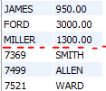

# 예제를 통한 실전 구문
my_emp
| empno | ename  | job       | mgr  | hiredate   | sal     | comm    | deptno |
|-------|--------|-----------|------|------------|---------|---------|--------|
| 7369  | SMITH  | CLERK     | 7902 | 1980-12-17 | 800.00  |         | 20     |
| 7499  | ALLEN  | SALESMAN  | 7698 | 1981-02-20 | 1600.00 | 300.00  | 30     |
| 7521  | WARD   | SALESMAN  | 7698 | 1981-02-22 | 1250.00 | 500.00  | 30     |
| 7566  | JONES  | MANAGER   | 7839 | 1981-04-02 | 2975.00 |         | 20     |
| 7654  | MARTIN | SALESMAN  | 7698 | 1981-09-28 | 1250.00 | 1400.00 | 30     |
| 7698  | BLAKE  | MANAGER   | 7839 | 1981-05-01 | 2850.00 |         | 30     |
| 7782  | CLARK  | MANAGER   | 7839 | 1981-06-09 | 2450.00 |         | 10     |
| 7788  | SCOTT  | ANALYST   | 7566 | 1987-04-19 | 3000.00 |         | 20     |
| 7839  | KING   | PRESIDENT |      | 1981-11-17 | 5000.00 |         | 10     |
| 7844  | TURNER | SALESMAN  | 7698 | 1981-09-08 | 1500.00 | 0.00    | 30     |
| 7876  | ADAMS  | CLERK     | 7788 | 1987-05-23 | 1100.00 |         | 20     |
| 7900  | JAMES  | CLERK     | 7698 | 1981-12-03 | 950.00  |         | 30     |
| 7902  | FORD   | ANALYST   | 7566 | 1981-12-03 | 3000.00 |         | 20     |
| 7934  | MILLER | CLERK     | 7782 | 1982-01-23 | 1300.00 |         | 10     |
<br>

dept
| deptno | dname      | loc       |
|--------|------------|-----------|
| 10     | ACCOUNTING | NEW YORK  |
| 20     | RESEARCH   | DALLAS    |
| 30     | SALES      | CHICAGO   |
| 40     | OPERATIONS | BOSTON    |
<br>

salgrade
| grade | losal | hisal |
|-------|-------|-------|
| 1     | 700   | 1200  |
| 2     | 1201  | 1400  |
| 3     | 1401  | 2000  |
| 4     | 2001  | 3000  |
| 5     | 3001  | 9000  |
<br>

X
| productid | inventory |
|-----------|-----------|
| A         | 5         |
| E         | 7         |
<br>

Y
| productid | inventory |
|-----------|-----------|
| A         | 1         |
| B         | 2         |
| C         | 3         |
|           | 1         |
```sql
CREATE TABLE X(
	productid VARCHAR(5),
    inventory INT4
);

CREATE TABLE Y(
	productid VARCHAR(5),
    inventory INT4
);

INSERT INTO X SET productid = 'A', inventory = 5; 
INSERT INTO X SET productid = 'E', inventory = 7; 
INSERT INTO Y values('A', 1); 
INSERT INTO Y values('B', 2); 
INSERT INTO Y values('C', 3); 
INSERT INTO Y SET  inventory = 1; 

CREATE TABLE salgrade(
	grade VARCHAR(5),
    losal INT,
    hisal INT
);

INSERT INTO salgrade SET grade = 'E', losal = 700, hisal = 1200;
INSERT INTO salgrade values('D', 1201, 1400);
INSERT INTO salgrade values('C', 1401, 2000);
INSERT INTO salgrade values('B', 2001, 3000);
INSERT INTO salgrade values('A', 3001, 9000);
```
<br>

## JOIN
조인에는 Hash Join이 많이 이용된다.
> Hash Join의 장점
> - 대규모 데이터셋에 적합: 해시 조인은 대규모 데이터셋에 대해 높은 성능을 제공합니다.
> - 시간 복잡도: 일반적으로 해시 조인은 선형 시간 복잡도(O(n + m))를 가집니다.

> 추가 사항
> - 실제 SQL 쿼리에서 Hash Join을 명시적으로 지정하는 것은 일반적이지 않습니다. 대부분의 데이터베이스 시스템은 쿼리 최적화기가 조인 유형을 자동으로 결정합니다.
>- Hash Join은 메모리에 해시 테이블을 온전히 저장할 수 있을 때 최적의 성능을 발휘합니다. 메모리가 부족하면 성능이 저하될 수 있습니다.

데이터베이스의 쿼리 최적화기는 여러 통계와 실행 계획을 분석하여 최적의 조인 방식을 결정합니다. 이 과정에서 Hash Join, Nested Loop Join, Sort-Merge Join 등 다양한 조인 방식 중에서 가장 효율적인 것을 선택합니다.  

**2중 조인할 때는 테이블에 제약조건이 있는 것을 선조인, 나머지는 후조인**

### INNER JOIN 
```sql
SELECT * FROM x
INNER JOIN y ON x.productid = y.productid;      # A 5 A 1


SELECT *
FROM emp
JOIN dept USING(deptno);     # USING을 쓰면 deptno가 앞으로 가고 deptno 컬럼은 하나만 출력

SELECT *
FROM emp e
INNER JOIN dept d ON e.deptno = d.deptno;       # ON을 쓰면 deptno가 두번 나온다.

SELECT *
FROM emp e, dept d
WHERE e.deptno = d.deptno;                      # WHERE로도 JOIN과 같은 결과를 출력 가능

-- JOIN을 사용하는 것이 일반적으로 더 권장되며, 특히 복잡한 쿼리와 큰 데이터셋의 경우 더욱 그렇습니다.
```

### OUTER JOIN
```sql
SELECT *                                            # A    5    A    1
FROM x                                              # null null B    2
RIGHT OUTER JOIN y ON x.productid = y.productid;    # null null C    3
                                                    # null null null 1
                                                    # null null null 1
SELECT *                                        
FROM x                                              # A    5    A    1
LEFT OUTER JOIN y ON x.productid = y.productid;     # E    7    null null
```

### UNION
UNION (중복항목 x 자동으로 제거함)  
UNION ALL (중복항목 O 중복도 출력한다)
```sql
SELECT ename, sal FROM emp
UNION
SELECT empno, ename FROM emp;
-- UNION은 컬럼 수만 같으면 무조건 합쳐버린다.
```


### FULL OUTHER JOIN
right outer join + left outer join느낌. 해당 명령은 없어진 곳이 많으니 UNION 해야함.  
union은 전체 테이블을 탐색하기 때문에 비용이 많이 든다. 혹시라도 full outer join을 지원하면 그걸 쓰자.
```sql
SELECT *
FROM x                                              # A    5    A    1
RIGHT JOIN y ON x.productid = y.productid           # null null B    2
UNION                                               # null null C    3
SELECT *                                            # null null null 1
FROM x                                              # E    7    null null
LEFT JOIN y ON x.productid = y.productid;
    -- 아무도 없는 부서인 40번 보스턴부서도 나온다.
```

### SELF JOIN
한 테이블의 같은 값을 가진 컬럼을 조인하는 것. 테이블에 별칭을 줘야한다.
```sql
SELECT e.empno, e.ename, e.mgr, m.ename     # 사원의 매니저번호 mgr을 이용해서
FROM emp e                                  # 매니저 이름까지 출력하기
JOIN emp m ON e.mgr = m.empno;              # 허나 KING의 mgr은 null이라서 문제발생

SELECT e.empno, e.ename, e.mgr, m.ename
FROM emp e
LEFT JOIN emp m ON e.mgr = m.empno;
```

### NATURAL JOIN
두 테이블에서 동일한 이름을 가진 열을 기준으로 자동 조인한다.  
모든 데이터에 대해 알아야 오류가 없다고 보장할 수 있기 때문에 권장되지 않는 조인.
```sql
SELECT *
FROM emp
NATURAL JOIN dept;
```

### CROSS JOIN
교차조인. 데카르트 곱. 모든 경우의 수로 조인을 한다.  
결과가 기하급수로 늘어날 수 있기 때문에 주의해서 써야하고 특별한 경우가 아니면 잘 안 쓴다.
```sql
SELECT *
FROM emp
CROSS JOIN dept;

SELECT *
FROM emp, dept;
-- CROSS 조인은 이 구문과 같다.
```

### INTERSECT
https://dev.mysql.com/doc/refman/8.0/en/intersect.html  
INTERSECT 연산자는 SQL에서 두 쿼리의 결과 집합에서 중복되는 행만을 반환하는 데 사용됩니다. 이는 두 쿼리 결과의 교집합을 구하는 것과 같습니다.  
각 쿼리의 컬럼 수와 데이터 타입이 일치해야 합니다.  
```sql
TABLE emp INTERSECT TABLE emp;

SELECT emp_name
FROM employees
INTERSECT
SELECT mgr_name
FROM managers;
```

### Equi Join　Nested Loop Join　 Merge Join
Equi Join은 INNER JOIN과 같다. 지금은 사장됨.  
Nested Loop Join과 Merge Join은 조인 알고리즘으로 이해만 하고 넘어가자.  
Nested Loop Join은 한 테이블의 각 행에 대해 다른 테이블을 반복적으로 스캔하여 조인을 수행하는 방법입. 주로 한 테이블이 작고 다른 하나가 큰 경우 또는 적절한 인덱스가 있는 경우에 사용된다.  
Merge Join은 두 테이블을 먼저 정렬한 후, 정렬된 순서대로 행을 병합하여 조인하는 방식. 이 방식은 두 테이블이 이미 정렬되어 있거나 크기가 비슷한 경우에 효율적이다.

## Exam
```sql
-- Q1. DALLAS에서 근무하는 사원의 이름, 직위, 부서번호, 부서이름을 출력
SELECT ename, job, e.deptno, dname
FROM emp e
JOIN dept USING(deptno)
WHERE loc = 'DALLAS';

SELECT ename, job, deptno, dname
FROM emp, dept
WHERE loc = 'DALLAS';


-- Q2. 이름에 'A'가 들어가는 사원들의 이름과 부서이름을 출력
SELECT ename, dname
FROM emp
LEFT JOIN dept USING(deptno)
WHERE ename REGEXP '[A]';

SELECT ename, dname
FROM emp e, dept d
WHERE ename LIKE '%A%' AND e.deptno = d.deptno;


-- Q3. 사원이름, 부서명, 월급을 출력하는데 월급이 3000이상인 사원만 출력
SELECT ename, dname, sal
FROM emp
LEFT JOIN dept USING(deptno)
WHERE sal >= 3000;

SELECT ename, dname, sal
FROM emp e, dept d
WHERE sal >= 3000 AND e.deptno = d.deptno;


-- Q4. 커미션이 책정된 사원의 사원번호, 이름, 연봉, 실급여, 급여등급을
-- 출력하되 실급여는 월급과 커미션의 합으로 표현하라
SELECT empno, ename, sal*12, sal+comm, grade
FROM emp
LEFT JOIN salgrade ON(sal BETWEEN losal AND hisal)
WHERE comm IS NOT NULL;

SELECT empno, ename, sal*12, sal+comm, grade
FROM emp, salgrade
WHERE sal BETWEEN losal AND hisal AND comm IS NOT NULL;


-- Q5. 부서번호 10인 사원의 부서번호, 부서이름, 사원이름, 월급, 급여등급을 출력
SELECT d.deptno, dname, ename, sal, grade
FROM emp
LEFT JOIN dept d USING(deptno)
LEFT JOIN salgrade ON(sal BETWEEN losal AND hisal)
WHERE deptno = 10;

SELECT d.deptno, dname, ename, sal, grade
FROM emp e, dept d, salgrade
WHERE d.deptno = 10 AND sal BETWEEN losal AND hisal AND e.deptno = d.deptno;


-- Q6. 부서번호가 10번, 20번인 사원들의 부서번호, 부서이름, 사원이름, 월급,
-- 급여등급을 출력하라. 그리고 출력물은 부서번호가 낮은 순으로, 월급이  
-- 높은 순으로 정렬하라
SELECT deptno, dname, ename, sal, grade
FROM emp 
LEFT JOIN dept USING(deptno)
LEFT JOIN salgrade ON(sal BETWEEN losal AND hisal)
WHERE deptno IN(10, 20)
ORDER BY deptno, sal DESC;

SELECT e.deptno, dname, ename, sal, grade
FROM emp e, dept d, salgrade
WHERE e.deptno = d.deptno AND e.deptno IN(10,20) AND sal BETWEEN losal AND hisal
ORDER BY e.deptno, sal DESC;


-- Q6. 부서번호가 10번, 30번인 사원들의 부서이름, 사원이름, 월급, 급여등급,
-- 관리자이름을 출력하라. 그리고 출력물은 부서번호 순, 입사일이 최근인 순으로,
-- 이름은 알파벳 순으로 정렬하라
SELECT dname, e.ename, e.sal, grade, m.ename
FROM emp e
LEFT JOIN dept USING(deptno)
LEFT JOIN emp m ON(e.mgr = m.empno)
LEFT JOIN salgrade ON(e.sal BETWEEN losal AND hisal)
WHERE e.deptno IN(10, 30)
ORDER BY e.deptno, e.hiredate DESC, e.ename;

# 조인없으면 2000줄임;;


-- Q7. 사원번호, 사원이름, 그리고 그 사원을 관리하는 관리자의 
-- 사원번호와 사원이름을 출력하라               ★
SELECT e.empno, e.ename, m.empno, m.ename
FROM emp e
LEFT JOIN emp m ON(e.mgr = m.empno);

SELECT e.empno, e.ename, e.mgr, CASE WHEN e.mgr IS NOT NULL THEN m.ename ELSE null END
FROM emp e, emp m
WHERE e.mgr = m.empno OR (e.mgr IS NULL AND e.empno = m.empno);


-- Q8. 자신의 관리자보다 먼저 입사한 모든 사원의 이름 및 입사일을 해당
-- 관리자의 이름 및 입사일과 함게 표시해라
SELECT e.ename, e.hiredate, m.ename, m.hiredate
FROM emp e
LEFT JOIN emp m ON(e.mgr = m.empno)
WHERE e.hiredate < m.hiredate;

WHERE DATEDIFF(e.hiredate, m.hiredate) < 0;  -- 이거도 가능.

SELECT e.ename, e.hiredate, m.ename, m.hiredate
FROM emp e, emp m
WHERE e.hiredate < m.hiredate AND e.mgr = m.emp;


-- Q9. 해당 부서의 모든 사원에 대한 부서 이름, 위치,
-- 사원 수 및 평균 급여를 표시하는 정의를 작성      ★
SELECT dname, loc, COUNT(empno), AVG(sal)
FROM dept d
LEFT JOIN emp e USING(deptno)
GROUP BY d.deptno;

SELECT dname, loc, COUNT(empno), AVG(sal)
FROM dept d, emp e
WHERE d.deptno = e.deptno
GROUP BY d.deptno;      -- GROUP BY 때문에 사원이 없는 40번 부서를 LEFT JOIN처럼
                        -- 출력할 수가 없다. WHERE는 INNER JOIN과 유사하기 때문.
```

```sql
-- 잡문제
-- Q1. 각사원의 이름과 월급 그리고 사원의 급여 등급을 출력해보자.


-- Q2. 직위가 'SALESMAN'인 사원들의 직위와 그 사원이름, 그리고
-- 그 사원이 속한 부서 이름을 출력하라.

```

```sql
-- 코스트 확인하는 방법
EXPLAIN FORMAT=TREE     # 여기서 cost랑 rows까지 나옴.
SELECT deptno, dname, ename, sal, grade 
FROM emp 
LEFT JOIN dept USING(deptno) 
LEFT JOIN salgrade ON(sal BETWEEN losal AND hisal) 
WHERE deptno IN(10, 20) 
ORDER BY deptno, sal DESC;

/*
cost를 줄이는 쿼리문 팁? 너무 뻔하지만?
1. 인덱스를 활용하자 (where, join, order by절 등의 구문 사용시 따라옴)
2. where 절에 사용되는 조건의 인수를 조절해야함.
3. 와일드 카드 * 가 시간 소모 많음. 행수 제한 limit 사용하기. fetch first 구문 사용하기.
4. 정렬, 그룹화가 필요하지 않을 때 정렬 및 그룹화 하지 않기
5. distinct 고윳값 추출. 이거 사용 자제해야함.
6. 조인할 때 크로스 조인같은거 데카르트 곱을 하기 때문에 안함.
*/

SET SESSION profiling = ON; # 프로파일링 기능 활성화
SET SESSION profiling = OFF; # 프로파일링 기능 활성화
-- profiling_history_size 세션 변수에 의해 제어됩니다. 이 변수의 기본값은 15이며 최대값은 100입니다. profiling_history_size 값을 0으로 설정하면 프로파일링이 사실상 비활성화됩니다​
SHOW PROFILES;
SHOW PROFILE;
SHOW STATUS LIKE 'Last_query_cost';
    -- 마지막 실행한 쿼리의 코스트를 알려줌.
```

