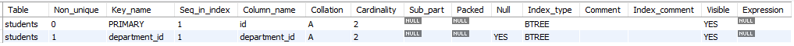
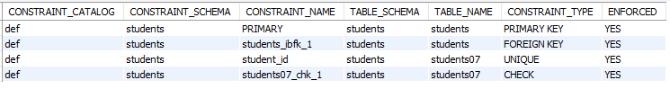
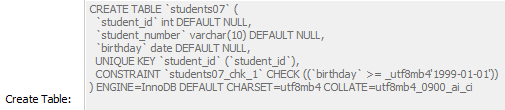

# 예제를 통한 실전 구문

## Table CRUD

### DB 만들기
```sql
CREATE DATABASE students;

USE students;
```

### 테이블 만들기, 드랍하기, 정보보기
```sql
DROP TABLE students;

CREATE TABLE students(
    student_id      INT,
    student_number  VARCHAR(10) NOT NULL,      -- 여기 붙는 NOT NULL 같은 걸
    first_name      VARCHAR(50) NOT NULL,      -- "열 제약 조건" (Column Constraints)
    last_name       VARCHAR(50) NOT NULL,      -- "열 옵션" (Column Options) 이라고 한다
    birthday        DATE,
    gender          ENUM('M', 'F'),
    paid_flag       BOOL,

    PRIMARY KEY (student_id)   -- PK를 줬기 때문에 자동으로 NOT NULL 및 중복 불가가 적용됨
);

DESC students;
```
```sql
INSERT INTO students VALUES(1, 123, 'FN', 'LN', NOW(), 'M', True);
INSERT INTO students VALUES(2, 123, 'FN', 'LN', NOW(), 'f', 0);
    # 성별 enum 대소문자 상관없음. BOOL에 True, False 대신 1, 0도 가능.
INSERT INTO students VALUES(3, 123, 'FN', 'LN', NOW(), NULL, True);
    # 성별 enum NOT NULL이 아니라서 NULL 들어감. 
INSERT INTO students VALUES(3, 123, 'FN', 'LN', NOW(), 'A', True);
    # 당연히 PK 중복은 불가능. 심지어 enum에 A가 들어감.

SELECT * FROM students;     # 현재 MySQL에서는 PK순으로 정렬되어 나오지만 모든 디비가 그렇지는 않다고 함. 오히려 기본은 입력된 데이터 순으로 출력이라고 함.
```

### 복합키
Primary Key는 테이블의 각 행을 고유하게 식별하는 데 사용되기 때문에, 한 테이블에는 오직 하나의 Primary Key만 설정할 수 있다.  
그러나, 다중 열(composite key)의 조합으로 고유성을 판단할 수 있는 경우 여러 열에 PK를 줄 수 있고 이게 복합키다. 테이블을 살펴보다가 PK가 두 개 이상이라면 복합키인 것이다.

```sql
CREATE TABLE students03(
	student_id 		INT ,
    student_number 	VARCHAR(10),

    PRIMARY KEY (student_id, student_number)			
);
```
```sql
INSERT INTO students03 VALUES(1, 1);
INSERT INTO students03 VALUES(1, 2);
INSERT INTO students03 VALUES(2, 2);
INSERT INTO students03 VALUES(2, 2);        # 복합키가 중복되니까 에러.
INSERT INTO students03 VALUES(NULL, 3);     # student_id가 PK의 일종인 복합키니까 null 불가.
INSERT INTO students03 VALUES(3, NULL);     # 마찬가지
```

### AUTO_INCREMENT
```sql
CREATE TABLE students04(
    student_id      INT AUTO_INCREMENT,
    student_number  VARCHAR(10) NOT NULL,

    PRIMARY KEY (student_id)
);
```
```sql
INSERT INTO students04 VALUES(1, 1);
INSERT INTO students04 VALUES(2, 2);
INSERT INTO students04(student_number) VALUES(10);   # 3, 10
INSERT INTO students04(student_number) VALUES(20);   # 4, 20
INSERT INTO students04 VALUES(5);       # Error
    # 앞에 AUTO_INCREMENT가 있고 뒤에 NOT NULL이 있으니까 값을 하나만 넣으면 유연하게 자동증가하면서 뒤에 값이 들어가지 않을까? 하고 생각할 수 있는데. 응 어림없죠?

INSERT INTO students04 VALUES(100, 50);
INSERT INTO students04(student_number) VALUES(60);   # 101, 60
    # 앞에서 student_id에 100을 주면서 건너 뛰었기 때문에 101로 AUTO_INCREMENT한다.

ALTER TABLE students04 AUTO_INCREMENT = 30;     # AUTO_INCREMENT 시작점을 지정
    # 근데 여기서 30으로 지정해도 30부터 AUTO_INCREMENT 하지 않는다. 왜냐하면 앞에서 101을 마지막으로 끝났기 때문에 102보다 큰 수를 주지 않는한, 102부터 시작한다.
```

### DEFAULT
```sql
CREATE TABLE students055(
	student_id 		INT AUTO_INCREMENT,
    student_number 	VARCHAR(10) DEFAULT 'ABC',
    address			VARCHAR(50),

    PRIMARY KEY (student_id)	
);
```
```sql
INSERT INTO students055 VALUES(1,1,1);          # 1 1 1
INSERT INTO students055 VALUES(2);              # Error  주의 ★
INSERT INTO students055(address) VALUSE('QWE');     # 2 ABC QWE
INSERT INTO studnets055 VALUES();               # 3 ABC null
INSERT INTO students055(student_number) VALUES(2);      # 4 2 null
INSERT INTO students055(student_id) VALUES(6);      # 6 ABC null
INSERT INTO students055(student_number,address) VALUES(6, 'ZXC');  # 7 6 ZXC
```
DEFAULT는 값이 입력되지 않았을 때 null 대신 들어가는 개념이다.  
하지만 두번째 명령처럼 뇌빼고 DEFAULT 없는 값만 넣으면 오류가 난다. DEFAULT를 사용하고 싶다면 세번째 명령처럼 누락시킬 데이터와 누락시키지 않을 데이터를 미리 구분하고 값을 줄 필드만 따로 지정해서 데이터를 넣어야만 한다.  
단, 모두 기본값으로 채우고 싶다면 네번째 명령처럼 VALUES()만 써도 된다.

### UNIQUE KEY　CHECK
```sql
CREATE TABLE students07(
    student_id      INT,
    student_number  VARCHAR(10),
    birthday        DATE,

    UNIQUE KEY (student_id),                -- UNIQUE KEY는 PK와 달리 null을 지원
    CHECK (birthday >= '2000-01-01')        -- 입력값 범위 지정
);
```
```sql
INSERT INTO students07(student_id) VALUES(null);
INSERT INTO students07 VALUES();
INSERT INTO students07(student_id, birthday) VALUES(1, DATE(NOW())) # 1 null 2023-12-23
INSERT INTO students07(student_id, birthday) VALUES(1, DATE(NOW())) # Error
INSERT INTO students07(student_id, birthday) VALUES(2, '1999-09-09') # Error
```

### FOREIGN KEY
**FOREIGN KEY (FK를 줄 열이름) REFERENCES 다른 테이블명 (참조하려는 다른 테이블의 컬럼명)**

외래 키(Foreign Key)는 한 테이블의 열(또는 열들의 조합)이 다른 테이블의 프라이머리 키(Primary Key)를 참조하는 관계를 설정하는 데 사용됩니다.  
외래 키 제약 조건은 데이터 무결성을 유지하는 데 중요한 역할을 합니다.  
이를 통해 참조 무결성(Referential Integrity)이 보장되어, 한 테이블의 열 값이 다른 테이블의 존재하는 행을 참조하도록 합니다.  
> 기본 특징
>1. 참조 무결성: 외래 키 값은 참조하는 테이블의 프라이머리 키 값과 일치해야 합니다.
>2. NULL 허용: 외래 키는 NULL 값을 가질 수 있습니다(특정 상황에서).
>3. 업데이트 및 삭제 제한: 참조하는 테이블의 행이 업데이트되거나 삭제될 때, 외래 키를 포함하는 테이블에 영향을 미칠 수 있습니다.
```sql
CREATE TABLE departments(
    id      INT PRIMARY KEY,
    name    VARCHAR(50)
);

CREATE TABLE students(
    id              INT PRIMARY KEY,
    name            VARCHAR(50),
    department_id   INT,

    FOREIGN KEY (department_id) REFERENCES Departments(id)
);

INSERT INTO departments (id, name) VALUES (1, 'Computer Science');
INSERT INTO departments (id, name) VALUES (2, 'Mathematics');

INSERT INTO students (id, name, department_id) VALUES (101, 'Alice', 1);
INSERT INTO students (id, name, department_id) VALUES (102, 'Bob', 2);
```
```sql
SELECT s.name, d.name
FROM students s
JOIN departments d ON(d.id = s.department_id);

INSERT INTO students VALUES (103, 'Smith', null);       # 103 Smith null
    -- department_id가 NOT NULL은 아니기 때문에 입력 된다.
INSERT INTO students VALUES (104, 'Jane', 3);           # Error
    -- 3번 학과는 없기 때문에 오류난다.
```

### Constraints 제약조건
```sql
SHOW KEYS FROM students;
```
**테이블의 키 확인**



<br>

```sql
SELECT *
FROM INFORMATION_SCHEMA.TABLE_CONSTRAINTS
WHERE TABLE_NAME = 'students';

SELECT *
FROM INFORMATION_SCHEMA.TABLE_CONSTRAINTS
WHERE TABLE_NAME IN ('students', 'students07');
```
**테이블의 키를 포함한 모든 제약조건의 이름과 타입을 볼 수 있다.** 즉, 추후에 테이블은 안 건드리고 제약조건을 삭제하고 싶을 때 이런 명령으로 확인해야 한다.


<br>

```sql
ALTER TABLE students03 DROP PRIMARY KEY;
ALTER TABLE students07 DROP CONSTRAINT students07_chk_1;
ALTER TABLE students DROP CONSTRAINT students_ibfk_1;
```
**제약조건 삭제.**

<br>

```sql
ALTER TABLE students07 ADD CONSTRAINT PRIMARY KEY (student_id);     # Error
ALTER TABLE students07 ADD CONSTRAINT UNIQUE KEY (studnet_id);
ALTER TABLE students07 ADD CONSTRAINT CHECK (birthday >= '2030-01-01'); # Error
ALTER TABLE students07 ADD CONSTRAINT CHECK (birthday >= '1999-01-01');
```
**제약조건 추가.** 추가하려는 제약조건이 이미 있는 데이터들을 충족 못 시키면 추가할 수 없다.

<br>

```sql
SELECT * FROM INFORMATION_SCHEMA.CHECK_CONSTRAINTS;
```
**체크 제약 조건 확인.** 다른 디비면 디비엠에스 권한이 있으면, 제약조건을 모든 정보를 볼 수 있다. 근데 마스큐는 innodb의 information_schema에 분할되어 들어가 있다.

<br>

```sql
SHOW CREATE TABLE students07;
```
**테이블의 제약조건 확인.** CREATE로 확인하는거라 테이블 생성될때 제약조건이 보일거 같지만, 의외로 그 테이블의 현재 제약조건이 보인다. (아래 이미지 birthday 확인)  
https://dev.mysql.com/doc/refman/8.0/en/show.html  



