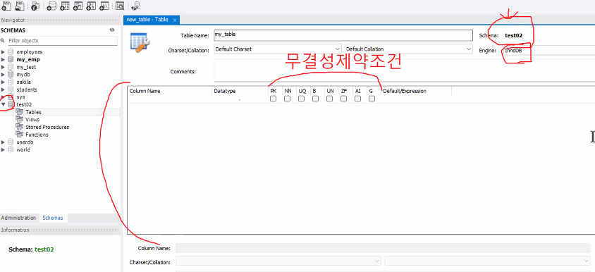
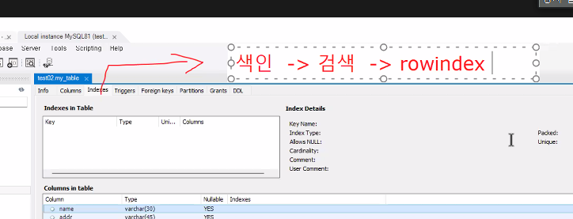
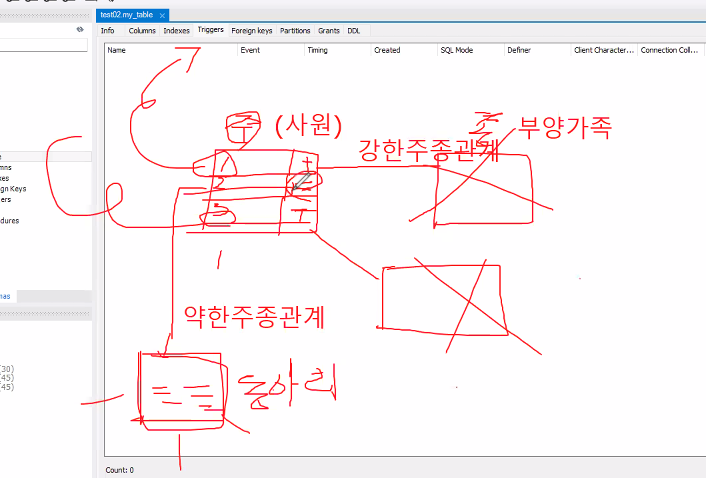
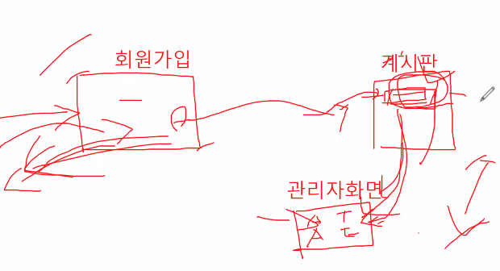
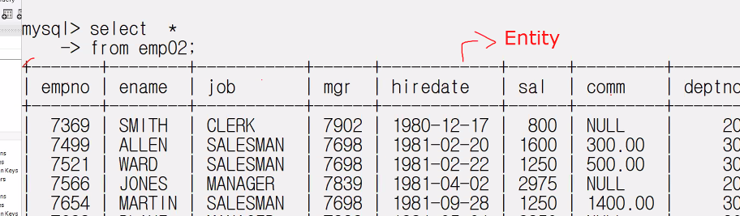

DB는 클라이언트를 관리하는게 목적.

DB와 OS간의 포트, OS와 Client간의 포트가 있고 모두 TCP/IP통신을 한다.

보안은 OS에서 한번, DB에서 한번, 클라이언트툴에서 한번.

TCP/IP 통신할 때 공백 안됨.

커넥터/드라이버는 DB에 CRUD(관리)를 하기위해 접속할 때 요구하는 것으로 TCP/IP통신의 소켓외에 추가로 요구되는거다.

쓰레드는 메소드 단위로 실행되는거 프로세스는 프로그램 단위로 실행된느거.

INNODB의 3대 특징  
1. 동시성 제어 = 트랜잭션  
    - 트랜잭션(커밋(=저장)과 롤백): 트랜잭션에 따라 단가가 정해질 정도.
2. 복구율이 좋다
3. 버퍼풀

select구문 -> 함수(수치함수, 날짜함수, 집계함수 등) -> 조인 -> 서브쿼리 -> 계정관리(CRUD), 권한관리 -> table 관리 -> function -> 프로시저 -> 트리거 순으로 할거임.

day01  
1. 데이터베이스 서버구조, 클라이언트 구조 설정 파일을 이해하고 활용할 수 있다.
2. 생성된 테이블의 구문을 활용할 수 있다.
3. 테이블의 데이터 추출문 SELECT 구문을 활용해서 결과를 리턴받을 수 있다.

-가 하나면 약어 --면 풀네임
mysql -u root -p -h localhost

하나의 스키마(Schema)는 여러개의 DB를 가지고 있다.

무결성 제약 조건.

색인을 걸면 이진트리로 빠르게 찾아준다.

테이블은 크게 두 가지 관계로 나눌 수 있다.  
강한주종관계  
약한주종관계  

어떤 테이블에서 CRUD할 때 다른테이블도 동시에 혹은 전후로 CRUD를 하는걸 트리거 Triggers라고 한다.  
after, berfor, new등의 표시가 있다.

Foreign keys 참조 키.

Grants 권한.  
%가 administrator임.

Entity

회사부서와 회사원 테이블을 다루면 회사부서가 주가되고 회사원은 종이된다.  
그리고 하나의 부서에는 여러 회사원이 있을 수 있으니까, 1:many로 표현할 수 있다.  

DB를 가져오면, DB > tables > entity > 주종관계 > null, 0

데이터 타입   
varchar - 문자열  
number - 숫자  
datetime - 워낙 형태가 다양해서 varchar로 하는 경우가 많다.

Key가 PRI(primary)면 중복데이터 안되고 null값 안된다. 즉, Not Null이다.

use {스키마명}  해당 스키마로 이동.
select * from {테이블명}  테이블을 읽음.

