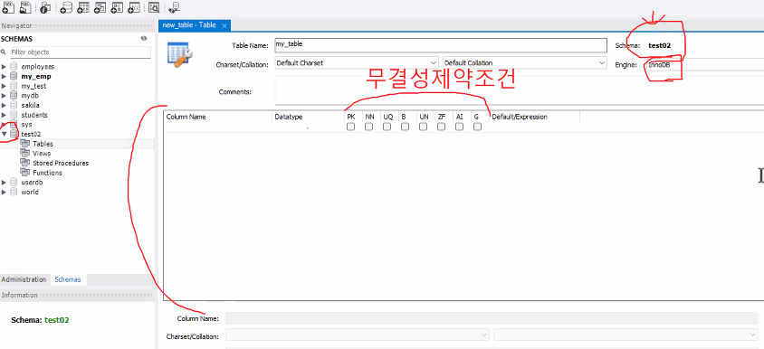
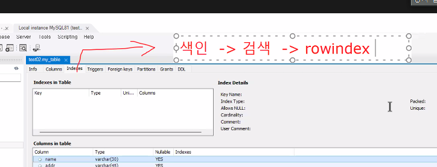
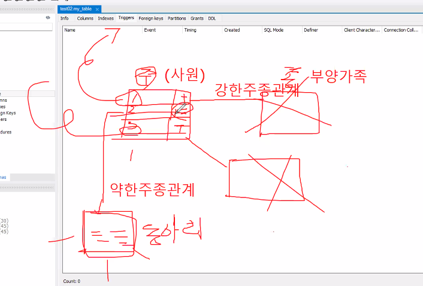
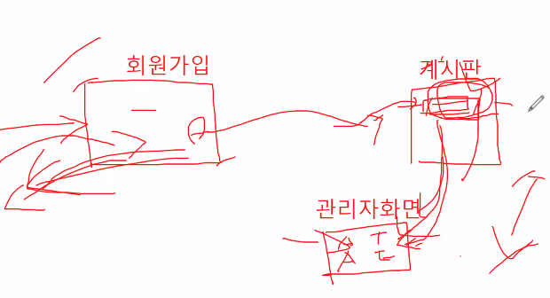
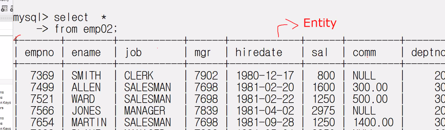
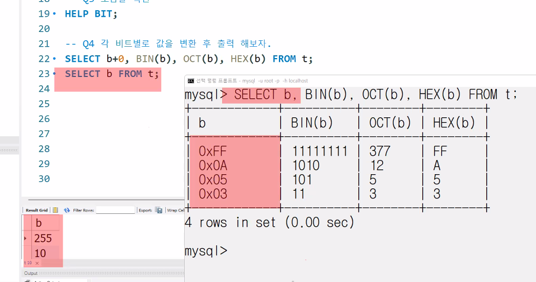
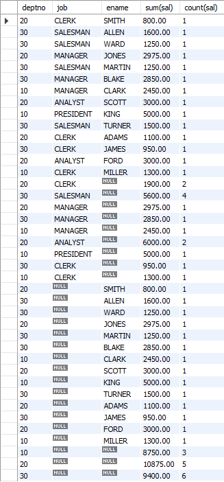

DB는 클라이언트를 관리하는게 목적.
DB 기본 단위는 블럭 block이다.
DB와 OS간의 포트, OS와 Client간의 포트가 있고 모두 TCP/IP통신을 한다.

보안은 OS에서 한번, DB에서 한번, 클라이언트툴에서 한번.

TCP/IP 통신할 때 공백 안됨.

커넥터/드라이버는 DB에 CRUD(관리)를 하기위해 접속할 때 요구하는 것으로 TCP/IP통신의 소켓외에 추가로 요구되는거다.

쓰레드는 메소드 단위로 실행되는거 프로세스는 프로그램 단위로 실행된느거.


INNODB의 3대 특징  
1. 동시성 제어 = 트랜잭션  
    - 트랜잭션(커밋(=저장)과 롤백): 트랜잭션에 따라 단가가 정해질 정도.
2. 복구율이 좋다
3. 버퍼풀


-가 하나면 약어 --면 풀네임
mysql -u root -p -h localhost


하나의 스키마(Schema)는 여러개의 DB를 가지고 있다.


무결성 제약 조건.




색인을 걸면 이진트리로 빠르게 찾아준다.




테이블은 크게 두 가지 관계로 나눌 수 있다.  
강한주종관계  
약한주종관계  


어떤 테이블에서 CRUD할 때 다른테이블도 동시에 혹은 전후로 CRUD를 하는걸 트리거 Triggers라고 한다.  
after, berfor, new등의 표시가 있다.



Foreign keys 참조 키.


Grants 권한.  
%가 administrator임.

Entity


회사부서와 회사원 테이블을 다루면 회사부서가 주가되고 회사원은 종이된다.  
그리고 하나의 부서에는 여러 회사원이 있을 수 있으니까, 1:many로 표현할 수 있다.  

DB를 가져오면, DB > tables > entity > 주종관계 > null, 0

데이터 타입   
varchar - 문자열  
number - 숫자  
datetime - 워낙 형태가 다양해서 varchar로 하는 경우가 많다.

Key가 PRI(primary)면 중복데이터 안되고 null값 안된다. 즉, Not Null이다.

use {스키마명}  해당 스키마로 이동.
select * from {테이블명}  테이블을 읽음.


----------
ODBC: 윈도우가 가지고 있는 DB 드라이버다. 라고 보면 쉽다.

변수 선언 및 보는 방법
SET @v1 = X'41';
SET @v2 = X'41'+0;
SET @v3 = CAST(X'41' AS UNSIGNED);
SELECT @v1, @v2, @v3;


워크벤치와 쉘에서 값이 다를 때가 있다.  
진법 데이터를 10진법으로 표기하고 싶을 때는 관습적으로 +0을 붙여주는게 필요하다.  
허나 SELECT에 +0을 하는 경우는 보안 문제도 있고 뭐 그래서 mysql에서 간단히 볼때만 쓰고 보통은 쓰지말라는데 뭐 설명을 대충하다 마냐. CAST함수를 쓰라신다



문자 인코딩에 greek, hebrew가 없으면 곤란해질 경우가 생길 수 있다.


#### String Data Types
https://dev.mysql.com/doc/refman/8.0/en/string-types.html  
BLOB은 영상,이미지 같은 이진데이터를 담을 때. 통으로 올릴 때 자주 사용.  
TEXT  
CHAR은 정적   비번관리할 때.  
VARCHAR 가변


DB는 숫자, 날짜, 문자를 서로 변환할 수 있는 메소드가 있다.
NOW() STR_TO_DATE() SEC_TO_TIME() 등등


distinct 키워드

# 예제를 통한 실전 구문
my_emp
| empno | ename  | job       | mgr  | hiredate   | sal     | comm    | deptno |
|-------|--------|-----------|------|------------|---------|---------|--------|
| 7369  | SMITH  | CLERK     | 7902 | 1980-12-17 | 800.00  |         | 20     |
| 7499  | ALLEN  | SALESMAN  | 7698 | 1981-02-20 | 1600.00 | 300.00  | 30     |
| 7521  | WARD   | SALESMAN  | 7698 | 1981-02-22 | 1250.00 | 500.00  | 30     |
| 7566  | JONES  | MANAGER   | 7839 | 1981-04-02 | 2975.00 |         | 20     |
| 7654  | MARTIN | SALESMAN  | 7698 | 1981-09-28 | 1250.00 | 1400.00 | 30     |
| 7698  | BLAKE  | MANAGER   | 7839 | 1981-05-01 | 2850.00 |         | 30     |
| 7782  | CLARK  | MANAGER   | 7839 | 1981-06-09 | 2450.00 |         | 10     |
| 7788  | SCOTT  | ANALYST   | 7566 | 1987-04-19 | 3000.00 |         | 20     |
| 7839  | KING   | PRESIDENT |      | 1981-11-17 | 5000.00 |         | 10     |
| 7844  | TURNER | SALESMAN  | 7698 | 1981-09-08 | 1500.00 | 0.00    | 30     |
| 7876  | ADAMS  | CLERK     | 7788 | 1987-05-23 | 1100.00 |         | 20     |
| 7900  | JAMES  | CLERK     | 7698 | 1981-12-03 | 950.00  |         | 30     |
| 7902  | FORD   | ANALYST   | 7566 | 1981-12-03 | 3000.00 |         | 20     |
| 7934  | MILLER | CLERK     | 7782 | 1982-01-23 | 1300.00 |         | 10     |

## Basic
MySQL에서는 예약어(Keyword)만 대문자로 표기하고 나머지는 소문자로 쓰는게 관례다

### USE　SELECT　FROM　DESC　SHOW TABLES
```MySQL
USE my_emp;
SELECT * FROM my_emp;
DESC my_emp;                 # 필드명(컬럼명), 데이터 타입, Null 유무,
DESCRIBE my_emp;                   Key, Default, Extra 확인 가능
SHOW TABLES;                 # 전체 테이블 확인
SELECT * FROM emp,dept;      # 앞에 있는 emp 테이블에 맞춰 full join함
```

### AS
```MySQL
SELECT ename "사원 이름", empno '사원 번호'         FROM emp;   # 모두 같은 표현
SELECT ename AS "사원 이름", empno AS '사원 번호'   FROM emp;
SELECT ename AS 사원이름, empno AS 사원번호         FROM emp;   # 단, ''없으면 공백불가

SELECT E.ename, E.sal FROM emp E;         # 테이블에 별칭을 주면 select가 편해진다.
SELECT E.ename, E.sal FROM emp AS E;      # 단, '' "" 불가. 객체이름에 공백이 불가능한 이유랑 비슷

SELECT ename, deptno, dname
FROM emp, dept;         # 테이블 간 구분도 용이해진다. deptno 필드가 중복이라 오류나는데

SELECT E.ename, E.deptno, dname
FROM emp E, dept;       # 이럴 때, 별칭을 주면 오류가 발생하지 않는다.
```

### IFNULL　단순 연산
```MySQL
SELECT ename, sal*12 AS 연봉 FROM emp;

SELECT ename, sal, comm, sal + comm AS 급여      # comm에 null이 있어서
FROM emp;                                       # 연산결과인 급여에도 null이 생김

SELECT ename, sal, comm, sal + IFNULL(comm,0) AS 급여  # comm의 null을 0으로 처리함
FROM emp;

SELECT ename, IFNULL(comm, "없음") AS 커미션        # 숫자외에도 가능
FROM emp; 

SELECT ename, sal, comm, IFNULL(comm, sal) AS 커미션없으면급여   # 다른 필드로 대체 가능
FROM emp;

SELECT ename, sal, comm, sal * 0.85 + IFNULL(comm, 0) AS 실수령액    # 종합
FROM emp;
```

### WHERE　IN　AND　OR 　비교 연산
```MySQL
SELECT ename, sal               # 월급이 1000이상인 사람
FROM emp
WHERE sal >= 1000;

SELECT ename, deptno            # 부서 번호가 10인 사람
FROM emp
WHERE deptno = 10;

SELECT ename, deptno, sal       # 부서 번호가 10이고 월급이 1000이상인 사람
FROM emp
WHERE deptno = 10 AND sal >= 1000;

SELECT ename, deptno            # 부서 번호가 10이거나 20인 사람
FROM emp
WHERE deptno = 10 OR deptno = 20

SELECT ename, deptno            # 위와 동일. IN이 더 선호됨.
FROM emp
WHERE deptno IN(10,20);
```

### LIKE
```MySQL
SELECT ename
FROM emp
WHERE ename LIKE 'A%';

SELECT ename
FROM emp
WHERE ename LIKE '%T';

SELECT ename
FROM emp
WHERE ename LIKE '%L%L%';

SELECT ename
FROM emp
WHERE ename LIKE 'A%N';

SELECT ename
FROM emp
WHERE ename LIKE '_M%';                 # 이름 두번째 글자가 M인 사람
```

### ORDER BY
SELECT 절의 목록 중 하나 혹은 여럿을 기준으로 결과 집합을 정렬한다.
```MySQL
SELECT ename FROM emp ORDER BY ename;
SELECT ename FROM emp ORDER BY ename DESC;

SELECT ename, deptno
FROM emp                                # 부서번호는 내림차순으로
ORDER BY deptno DESC, ename;            # 같은 부서에서 이름은 오름차순으로 정렬

SELECT empno, ename, hiredate           # SELECT의 인덱스로 정렬가능.
ORDER BY 3;                             # 단, 인덱스는 1부터 시작하니까 주의
```

### IS NULL 　IS NOT NULL
```MySQL
SELECT ename, comm
FROM emp
WHERE comm IS NOT NULL;             # comm이 null이 아닌 사람들 출력. 300,500,1400,0

SELECT ename, comm
FROM emp
WHERE comm IS NULL;                 # comm이 null인 사람들 출력.
```

### 집계 함수 　SUM(), AVG(), COUNT(), MAX(), MIN(), STD(), VARIANCE()
```MySQL
SELECT SUM(sal), AVG(sal), COUNT(sal), MAX(sal), MIN(sal), STD(sal)
FROM emp;

SELECT SUM(ename), SUM(comm), SUM(IFNULL(comm,0))   # 문자열은 더할 수 없다.
FROM emp;                                           # SUM은 null을 더하지 않는다.

SELECT AVG(ename), AVG(comm), AVG(IFNULL(comm,0))   # avg는 null을 빼고 계산한다.
FROM emp;                                           # 그래서 null을 0으로 채우면 평균값이 바뀐다

SELECT COUNT(comm), COUNT(IFNULL(comm, 0))          # COUNT는 null을 세지 않는다.
FROM emp;

SELECT MAX(ename), MAX(sal), MAX(comm)              # MySQL은 MAX(문자열)이 가능하다
FROM emp;                                           # 다른 SQL은 안 될 수도 있으니 주의

SELECT STD(ename), STD(comm), STD(IFNULL(comm,0))   # null은 빼고 표준편차 구한다.
FROM emp;                                           # 그래서 null을 0으로 채우면 표준편차가 바뀐다.

SELECT VARIANCE(sal), VAR_POP(sal),             # 분산
       STD(sal), STDDEV(sal)                    # 표준편차
       VAR_SAMP(sal)                            # 표본분산
FROM emp;

SELECT AVG(sal)                         # 직업이 SALESMAN인 사람의 평균 월급
FROM emp
WHERE job = 'SALESMAN';

SELECT AVG(sal)                         # 부서가 10번이거나 20번인 사원의 평균 월급
FROM emp
WHERE deptno IN (10, 20);
```

### GROUP BY
GROUP BY를 쓰면 SELECT절에 GROUP BY로 그룹된 필드보다 더 큰 필드, 혹은 다른 필드는 올 수 없다.  
GROUP BY는 SELECT 절에서 지정한 열 또는 표현식에 따라 결과 집합을 그룹화하는 데 사용됩니다. GROUP BY로 그룹화된 필드 외에 다른 필드는 SELECT 절에 나열될 때 집계 함수를 사용해야 하며, 집계 함수를 사용하지 않는 필드는 GROUP BY 절에 포함되어야 합니다.  

미세 팁) **MySQL 쿼리의 실행 순서**:  
FROM > JOIN > WHERE > GROUP BY > 집계함수 > SELECT > HAVING > ORDER BY > LIMIT/OFFSET
```MySQL
SELECT deptno, AVG(sal)                     # 부서별 평균 월급
FROM emp
GROUP BY deptno;

SELECT job, MAX(sal)                        # 직업별 최대 월급
FROM emp
GROUP BY job;

SELECT job, deptno, AVG(sal)                # 부서 및 직업별로 평균 월급
FROM emp
GROUP BY job, deptno
ORDER BY 3;
```

### HAVING
HAVING 연산자는 GROUP BY에 연산되어 나눠진 데이터들을 다시 걸러주기 위해 사용.  
즉, 제 2의 WHERE 느낌이다.  
HAVING 다음에는 SELECT에서 사용한 컬럼과 그룹함수를 사용한 컬럼에 대해서만 조건을 줄 수 있다.
```MySQL
SELECT job, SUM(sal)    # job으로 그룹한 결과 중 5000이상만 보고 싶음. 
FROM emp                # 하지만 여기서 WHERE를 쓰면 오류난다.
WHERE 2 >= 5000      # 그룹된 애들에 조건을 주는건 WHERE로 안되고 HAVING을 써야한다.
GROUP BY job;

SELECT job, SUM(sal)
FROM emp
GROUP BY job
HAVING SUM(sal) >= 5000;            # 정답

SELECT deptno, AVG(sal)         # HAVING 조건이 SELECT와 같을 필요는 없다.
FROM emp                        # 부서내의 사원들의 월급합이 10000이상인 부서들의
GROUP BY deptno                 # 평균 월급이 궁금할 때, 이렇게 크로스해서 가능하다.
HAVING SUM(sal) >= 10000;
```

### WITH ROLLUP
그룹의 총계, 부분 소계.  
ROLLUP 연산자는 GROUP BY문과 WITH와 함께 사용해야함.  
```MySQL
SELECT deptno, SUM(sal)
FROM emp
GROUP BY deptno WITH ROLLUP;        # 부서별 월급합과 소계

SELECT deptno, empno, SUM(sal)      # 부서별 사원 개개인의 월급과 소계를 같이 출력.
FROM emp                                # ename 사원 이름은 출력할 수 없다.(오류)
GROUP BY deptno, empno WITH ROLLUP;     # 이는 나중에 따로 가져와야 함.

SELECT deptno, job, SUM(sal)
FROM emp
GROUP BY deptno, job WITH ROLLUP;       # 부서별로 나누고 직업별로 월급합을 출력

SELECT deptno, job, AVG(sal)            # 부서별로 직업별로 평균월급을 소계하고
FROM emp                                # 그 소계를 모아 총계를 구한다.
GROUP BY deptno, job WITH ROLLUP;       # 총계를 소계로 구하지 않기 때문에 꽤 쓸만함
```

### GROUPING()
GROUPING 함수는 GROUP BY와 함께 WITH ROLLUP 또는 WITH CUBE(MySQL은 없음)를 사용하여 그룹화된 결과에서 소계(Row Total)를 식별하는 데 사용되는 MySQL의 확장 함수다.  
그룹화된 열의 합계 레벨을 확인하여 0 또는 1의 값을 반환한다.  
```MySQL
SELECT job, SUM(sal), GROUPING(job)
FROM emp
GROUP BY job WITH ROLLUP;

SELECT deptno, job, AVG(sal), GROUPING(deptno), GROUPING(job)
FROM emp
GROUP BY deptno, job WITH ROLLUP;

SELECT job, ename, SUM(sal), GROUPING(job), GROUPING(ename)
FROM emp
GROUP BY job, ename WITH ROLLUP
ORDER BY 2;
```

### WITH CUBE
일단 MySQL 기본 쿼리문에 WITH CUBE는 없다. 다차원 집계를 수행할 때 사용되므로, 확장된 GROUP BY 기능 중 하나입니다. 

```MySQL
SELECT deptno, job, ename, SUM(sal)
FROM emp
GROUP BY deptno, job, ename WITH CUBE;

SELECT deptno, job, ename, SUM(sal)
FROM emp
GROUP BY cube(deptno, job, ename);

-- ---------- MySQL에서 유사 CUBE 구현하기-----------------

SELECT deptno, job, ename, SUM(sal), COUNT(sal)         
FROM emp                                    # 첫번째 그룹화: deptno, job, ename
GROUP BY deptno, job, ename 

UNION

SELECT deptno, job, NULL AS ename, SUM(sal), COUNT(sal)     
FROM emp                                    # 두 번째 그룹화: deptno, job
GROUP BY deptno, job

UNION

SELECT deptno, NULL AS job, ename, SUM(sal), COUNT(sal)     
FROM emp                                    # 세 번째 그룹화: deptno, ename
GROUP BY deptno, ename

UNION

SELECT deptno, NULL AS job, NULL AS ename, SUM(sal), COUNT(sal)     
FROM emp                                    # 네 번째 그룹화: deptno
GROUP BY deptno;

-- ---------- CUBE 구현 결과-----------------
```



